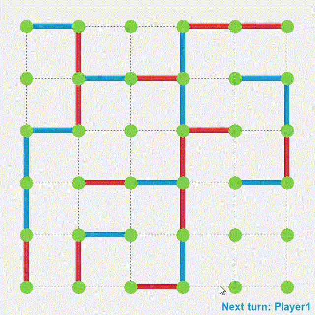
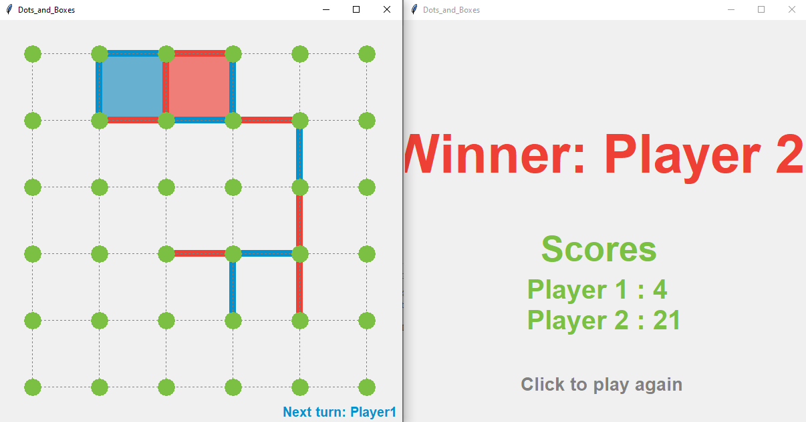

# Dots-and-Boxes


This repository contains python based interactive Dots-and-Boxes game.

## Running Dots-and-Boxes:

```
git clone https://github.com/khelli07/ai-dots-and-boxes.git
cd ai-dots-and-boxes/src
python main.py
```

<p align="center">

</p>

## Screenshots
<p align="center">


</p>

## Controls
1. Player 1 starts the game
2. Click on edges to mark them
3. If a box is made, it gets shaded with the player assigned color, and the player gets another go
4. When all the edges are marked, the result is displayed on the result screen
5. Click anywhere on the result screen to play again


## About
The original author is [Aqeel Anwar](https://www.prism.gatech.edu/~manwar8), but the rules has been fixed by [Jacrac04](https://github.com/Jacrac04/Dots-and-Boxes). Modified by GaIB 19 Assistants.
#� �a�i�-�d�o�t�s�-�a�n�d�-�b�o�x�e�s�
�
�
